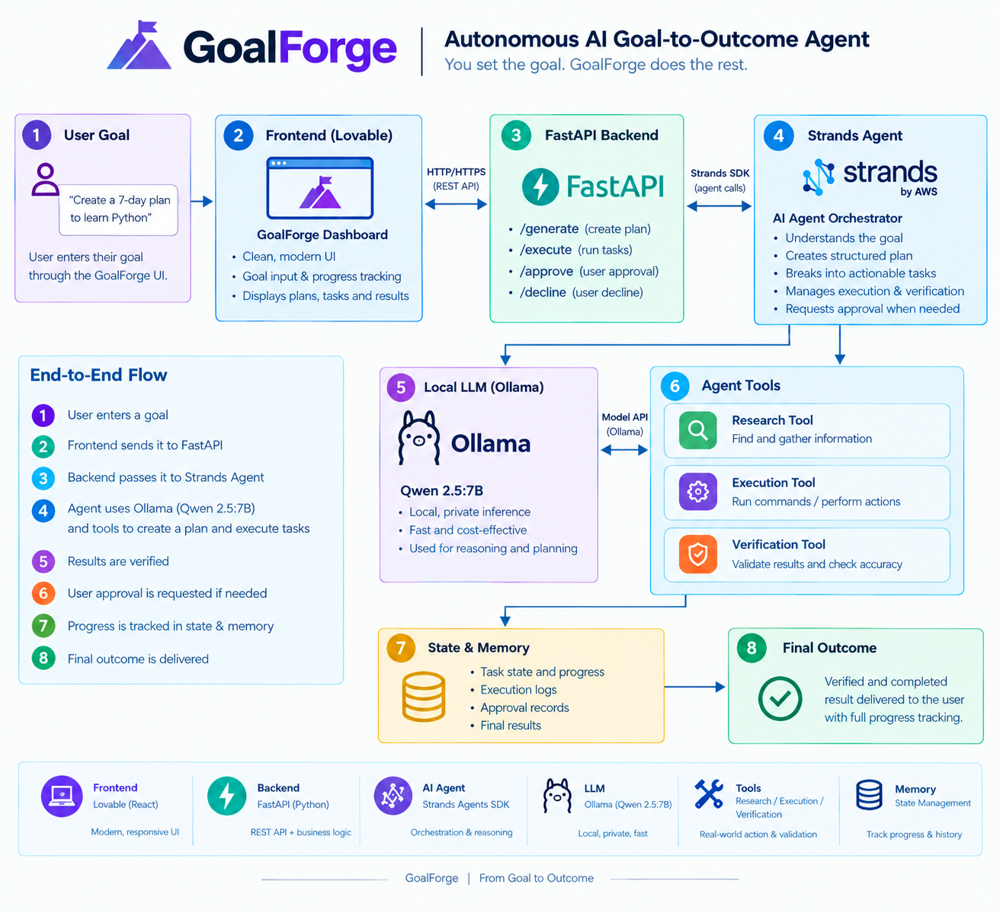

# GoalForge

## Autonomous AI Goal-to-Outcome Agent

GoalForge is an autonomous AI agent for **professional work**. Instead of simply answering questions or giving advice, GoalForge takes a high-level goal, turns it into an executable plan, works through the required tasks, verifies progress, and produces a final result.

> **Hackathon Track:** Professional Agents
> **Agent Framework:** Strands Agents SDK
> **Model Runtime:** Ollama + Qwen 2.5 7B
> **Backend:** Python + FastAPI
> **Frontend:** React / Lovable

---

## The Problem

Professional goals are rarely a single task.

A goal such as:

> "Create a 7-day Python learning plan for an upcoming interview."

requires multiple steps:

* understanding the desired outcome
* creating a structured plan
* breaking the plan into tasks
* researching information when necessary
* executing tasks
* checking whether the results are valid
* tracking progress
* handling failures or recovery
* presenting the completed outcome

Traditional AI chat interfaces usually stop after generating an answer.

**GoalForge is designed to continue working toward the outcome.**

---

## What GoalForge Does

GoalForge follows an agentic workflow:

```text
User Goal
    ↓
Goal Understanding
    ↓
Planning
    ↓
Task Breakdown
    ↓
Research / Execution
    ↓
Verification
    ↓
Recovery / Approval
    ↓
Final Result
```

The system maintains state throughout the workflow so that the user can see what the agent is doing and what has been completed.

### Core capabilities

* **Goal understanding** — interprets a high-level professional objective
* **Planning** — creates a structured execution plan
* **Task decomposition** — converts the plan into actionable tasks
* **Research** — gathers information when required
* **Execution** — performs supported work through backend tools
* **Verification** — checks generated results
* **Recovery** — handles unsuccessful execution paths
* **Approval requests** — allows human approval when an action requires it
* **State / memory** — tracks the goal, tasks, activity, approvals and results
* **Progress tracking** — exposes agent activity through the dashboard
* **Final outcome** — returns the completed result to the user

---

## Architecture



```text
┌─────────────────────────────┐
│       GoalForge UI          │
│     React / Lovable         │
└──────────────┬──────────────┘
               │ HTTP
               ▼
┌─────────────────────────────┐
│       FastAPI Backend       │
│        API Routes           │
└──────────────┬──────────────┘
               │
               ▼
┌─────────────────────────────┐
│     Strands Agent           │
│      Orchestrator           │
└──────────────┬──────────────┘
               │
       ┌───────┼────────┐
       ▼       ▼        ▼
   Planner   Runner   Research
       │       │        │
       └───────┼────────┘
               ▼
        Verification
               │
               ▼
         Memory / State
               │
               ▼
          Final Result

        Model Runtime
               │
               ▼
       Ollama / Qwen 2.5 7B
```

The required agent framework is **Strands Agents SDK**. The current implementation uses the Strands Ollama model integration for local model execution.

---

## Technology Stack

### Agent

* [Strands Agents SDK](https://github.com/strands-agents/sdk-python)
* `strands.Agent`
* `OllamaModel`

### Model

* Ollama
* Qwen 2.5 7B
* Configurable through environment variables

### Backend

* Python
* FastAPI
* Pydantic
* HTTP API

### Frontend

* React
* TypeScript
* Lovable-generated application
* GoalForge dashboard UI

---

## Project Structure

```text
goal-forge-dashboard/
│
├── backend/
│   ├── agents/
│   │   ├── orchestrator.py
│   │   ├── planner.py
│   │   └── runner.py
│   │
│   ├── api/
│   │   └── routes.py
│   │
│   ├── memory/
│   │   └── state.py
│   │
│   ├── models/
│   │   └── schemas.py
│   │
│   ├── tools/
│   │   ├── execution.py
│   │   ├── research.py
│   │   └── verification.py
│   │
│   └── main.py
│
├── src/
│   └── ... frontend application
│
├── requirements.txt
├── LICENSE
└── README.md
```

---

## Strands Agent Implementation

The core agent is implemented using the Strands Agents SDK.

The current model configuration uses Ollama:

```python
from strands import Agent
from strands.models.ollama import OllamaModel
```

The default model is:

```text
qwen2.5:7b
```

The Ollama host can be configured using:

```text
OLLAMA_HOST
```

and the model can be configured using:

```text
GOALFORGE_MODEL_ID
```

This keeps the model runtime configurable while the agent orchestration remains implemented with Strands.

---

## Running Locally

### Prerequisites

You need:

* Python 3.10+
* Node.js and npm
* Ollama
* Qwen 2.5 7B

### 1. Clone the repository

```bash
git clone https://github.com/Mani9105/goal-forge-dashboard.git
cd goal-forge-dashboard
```

### 2. Install Python dependencies

```bash
pip install -r requirements.txt
```

### 3. Install the local model

```bash
ollama pull qwen2.5:7b
```

Verify that Ollama can see the model:

```bash
ollama list
```

### 4. Configure Ollama

For a local Ollama installation, the default endpoint is:

```text
http://localhost:11434
```

The backend supports:

```bash
export OLLAMA_HOST=http://localhost:11434
export GOALFORGE_MODEL_ID=qwen2.5:7b
```

If Ollama is running in another environment, set `OLLAMA_HOST` to the address reachable from the FastAPI backend.

### 5. Start the backend

From the repository root:

```bash
uvicorn backend.main:app --host 0.0.0.0 --port 8000
```

Verify the backend:

```bash
curl http://localhost:8000/health
```

Expected response:

```json
{
  "status": "healthy"
}
```

### 6. Start the frontend

Install dependencies:

```bash
npm install
```

Start the development server:

```bash
npm run dev
```

---

## API

### Health Check

```http
GET /health
```

Example:

```bash
curl http://localhost:8000/health
```

### Generate a Goal Plan

```http
POST /generate
```

Example:

```bash
curl -X POST http://localhost:8000/generate \
  -H "Content-Type: application/json" \
  -d '{"goal":"Create a simple 7-day plan to learn Python"}'
```

The backend sends the goal through the GoalForge agent workflow and returns the generated result.

---

## Example Workflow

A user might enter:

```text
Create a simple 7-day plan to learn Python.
```

GoalForge can then:

1. Understand the requested outcome
2. Build a structured plan
3. Break the plan into tasks
4. Research information when needed
5. Execute supported tasks
6. Verify the resulting work
7. Recover when an execution step fails
8. Request approval when human input is required
9. Return the final result

The dashboard exposes this process through sections such as:

* Goal Input
* Plan
* Agent Activity
* Tasks
* Approval Requests
* Final Result

---

## Why This Is an Agent

GoalForge is not intended to be a simple chat interface.

The agent is responsible for moving from:

```text
Intent
  ↓
Plan
  ↓
Actions
  ↓
Verification
  ↓
Outcome
```

This makes the system useful for multi-step professional objectives where planning, execution and verification are all required.

---

## Hackathon Alignment

GoalForge was built for the **Professional Agents** track.

### New AI Agent

GoalForge is designed as a new autonomous agent for completing multi-step professional goals.

### Real Work

The system goes beyond conversational responses by creating plans, generating tasks, executing supported operations, researching information and verifying results.

### Strands Agents SDK

The core agent orchestration uses the **Strands Agents SDK**.

### Complete Product

GoalForge includes both:

* a user-facing dashboard
* an agent-powered FastAPI backend

rather than only a standalone model demonstration.

### Human-in-the-Loop

When an action requires user confirmation, GoalForge can surface an approval request rather than blindly proceeding.

---

## Current Model Runtime

The current hackathon implementation uses:

```text
Strands Agents SDK
        ↓
OllamaModel
        ↓
Qwen 2.5 7B
```

Amazon Bedrock is **not required** for the current implementation.

The architecture keeps the model layer configurable so that other supported model providers can be integrated in future deployments without redesigning the overall GoalForge workflow.

---

## Future Improvements

Potential future extensions include:

* Cloud deployment
* Additional professional-work tools
* More advanced persistent memory
* Richer verification strategies
* More external integrations
* Additional model providers
* AgentCore deployment
* More sophisticated multi-agent collaboration

---

## License

This project is licensed under the **MIT License**.

See [`LICENSE`](LICENSE) for details.

---

## Built For

GoalForge was created as an AI-agent project for the 2026 hackathon submission period.

The goal is simple:

> **Don't just tell people what to do. Work toward getting it done.**

